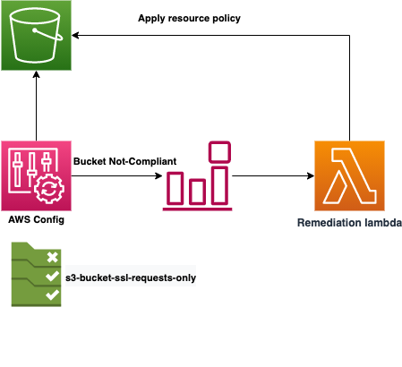

# s3-ssl-only-alerting

Code for solution on s3-ssl-only alerting and remediation

## Table of Contents

- [s3-ssl-only-alerting](#s3-ssl-only-alerting)
  - [Table of Contents](#table-of-contents)
  - [Description](#description)
    - [Main Features](#main-features)
  - [Prerequisites](#prerequisites)
  - [Variables](#variables)
  - [Example of usage](#example-of-usage)
  - [Tests](#tests)

## Description

This module setup up a check and remediation strategy for missing ssl-only access on S3 Bucket policy.

The following diagram applies to the current solution.



It uses AWS Managed Config rule [S3_BUCKET_SSL_REQUESTS_ONLY](https://docs.aws.amazon.com/config/latest/developerguide/s3-bucket-ssl-requests-only.html) to monitor the S3 buckets and trigger a lambda function which will put a ssl-only bucket policy
on "NON_COMPLIANT" buckets.

The AWS Config rule is triggered at creation, deletion and modification of every S3 bucket in the account.

The policy is

```json
{
  "Id": "ExamplePolicy",
  "Version": "2012-10-17",
  "Statement": [
    {
      "Sid": "AllowSSLRequestsOnly",
      "Action": "s3:*",
      "Effect": "Deny",
      "Resource": [
        "arn:aws:s3:::DOC-EXAMPLE-BUCKET",
        "arn:aws:s3:::DOC-EXAMPLE-BUCKET/*"
      ],
      "Condition": {
        "Bool": {
          "aws:SecureTransport": "false"
        }
      },
      "Principal": "*"
    }
  ]
}
```

> Pay attention:
this module is meant to be used as standalone module.

### Main Features

- It is possible to define a list of buckets to be excluded from the fix.
  They will continue to appear as "NOT_COMPLIANT" in AWS Config Dashboard;
- it is possible to pass the name of an already existing AWS Config rule. E.g. in case that `S3_BUCKET_SSL_REQUESTS_ONLY` is already turned on by another service (Security Hub).

## Prerequisites

This module expects that [AWS Config](https://aws.amazon.com/config/) is **already up and running in the region** where
the rules will be deployed and the rule `s3-bucket-ssl-requests-only` should be **already enabled**.

The setup can be easily done by following the official [documentation](https://docs.aws.amazon.com/config/latest/developerguide/setting-up-aws-config-rules-with-console.html).

## Variables

The available variables are described in [variables.tf](./variables.tf) file.

## Example of usage

In this example we are going to deploy the remediation lambda for missing s3 ssl-only policy
using an already running AWS Config rule.

```yaml
module "deploy_s3_ssl_only_remediation" {
  buckets_exclusion_list = "bucket_a,bucket_b",
  config_rule_name       = "s3-bucket-ssl-requests-only-already-on",
  source                 = "./modules/s3_https_remediation"
}
```

Please have a look inside inside [variables.tf](./variables.tf) for all the possible options.

Alternatively, if you have [Terraform](https://www.terraform.io/) installed on your workstation, you can deploy the example by executing:

```bash
export AWS_PROFILE=$MY_AWS_PROFILE
cd example
terraform init
terraform apply
```

> Pay attention:
you should first modify the `buckets_exclusion_list` and `region` in accordance to your requirements.

## Tests

Tests can be performed on the `Lambda` function code and on `Terraform` Code.
These tests are meant to be run locally.

Integration in any CICD pipelines needs to adapted if necessary taking inspiration from the file `test/test.sh`.

The used tool is:

- `Terratest` for unittest on IaC
- `Bandit` for secure check on python for Lambda
- `Checkov` for security check on IaC
- `pytest` for unittest on on python for Lambda

It is possible to run the tests with the following commands.

```sh
cd test
./test.sh
```
